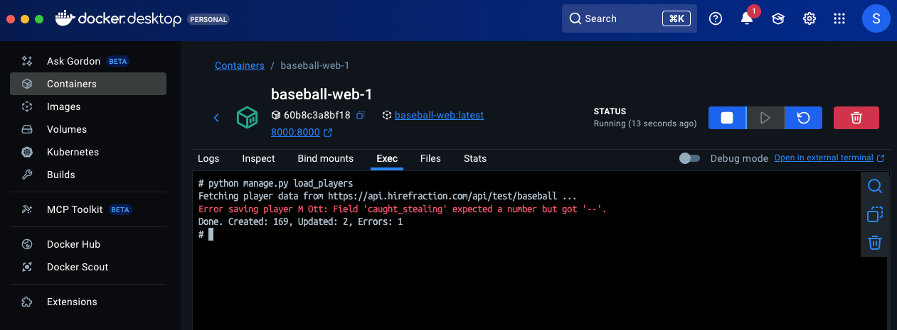

# Baseball

Baseball players & their stats - Django REST API with React frontend.

## Docker setup

1. Clone the repository
2. cd into the project directory Baseball
3. Make sure docker desktop is installed & running in the background
4. Run `docker-compose up --build` to build and start the containers
5. Access players using UI at http://localhost:3000/

## Example django command run

Run command inside web container:

`python manage.py load_players`

## Get players by hits (GET)

http://localhost:8000/api/baseball/players/by-hits/

## Get Decsription using LLM (GET)

http://localhost:8000/api/baseball/players/{player_id}/description/

e.g. http://localhost:8000/api/baseball/players/1/description/

## Update player using EDIT button (PUT)

http://localhost:8000/api/baseball/players/{player_id}/update/

## React Frontend UI

http://localhost:3000/

Opportunities for Improvement:

1. Pagination: Implement pagination for the player list API to handle large datasets efficiently.
2. unit & integration tests: Add comprehensive tests for both backend and frontend components to ensure reliability.
3. Error Handling: Improve error handling in the frontend to provide better user feedback.
4. Caching: Implement caching for frequently accessed data to improve performance.
5. UI Enhancements: Enhance the frontend UI with better styling and user experience features.
6. Authentication: Add user authentication and authorization for secure access to the API.
7. More checks on data ingestion: Validate and clean data during the load_players command to ensure data integrity.
